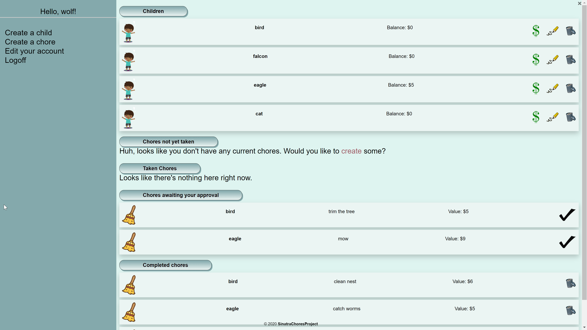
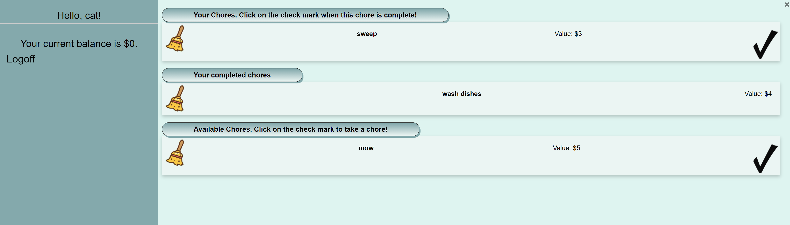

# Family Chore Tracker
This app was created to help busy parents keep track of chores their children are doing and allows them to incentivize these chores with a monetary value!

## Table of contents
* [General info](#general-info)
* [Screenshots](#screenshots)
* [Technologies](#technologies)
* [Setup](#setup)
* [Features](#features)
* [Status](#status)
* [Inspiration](#inspiration)
* [Contact](#contact)

## General info
An app built to help keep kids busy during these difficult times while they are at home and allow mom and dad to continue on with their days without multiple phone calls througout the day asking what the kids can do!

## Screenshots

Parent screen

## Technologies
* Ruby
* Sinatra
* ActiveRecord - version 4.2.6
* SQLite3 - version 1.3.6
* Bootstrap - version 4.0

****To see more about this process:****

Project Outline: https://docs.google.com/document/d/172tCgxtrcKU-H6djOgaRKyJyFxzaOeD8OBNFw_HXPBA/edit?usp=sharing

Blog Post: https://dev.to/meemeek/buttons-buttons-and-more-buttons-2oe5

THANKS FOR CHECKING OUT MY PROJECT!

## Setup
Clone this repo to your local machine `git clone <this-repo-url>`
run `cd sinatra-chores-project` to access
run `bundle install` to install required dependencies
run `rake db:migrate` to create the database tables
run `shotgun` in your terminal and follow link to the correct port

## Features
* Dedicated user path for child with large icons to make using the app easy for younger children.
* Verification in place to assure editing and deleting can only be done by the creating user.
* Full CRUD capabilities for the parent to thier account as well as any accounts created by them.

To-do list:
* Create options for image attachment to chores for young children unable to read.
* Create ability to have required chores, notifications.
* Create recurring chores.

## Status
Project is in progress.  Additional functionality still forthcoming.

## Inspiration
Project inspired by my children who would no longer use an app like this but still need to learn how to do some chores.  If only we had something like this when they were little maybe they would have learned how...

## Contact
Bug reports and pull requests are welcome on GitHub at https://github.com/mimirandi21/sinatra-chores-project.
